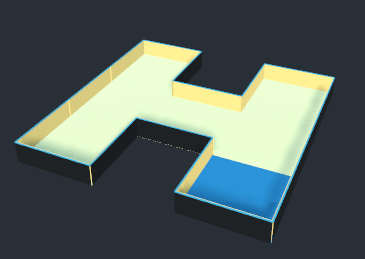
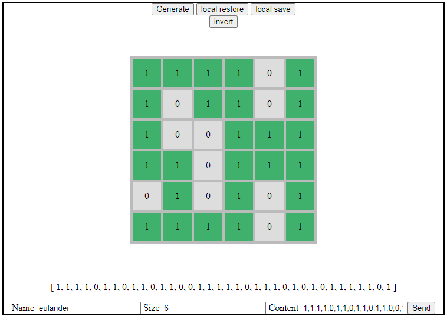
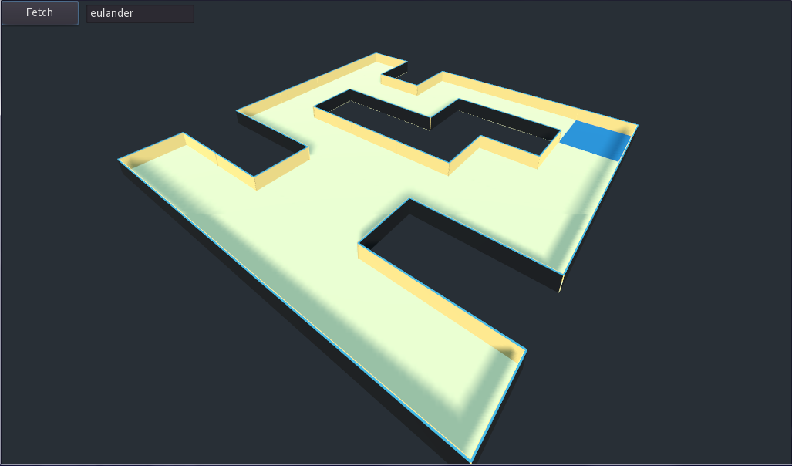
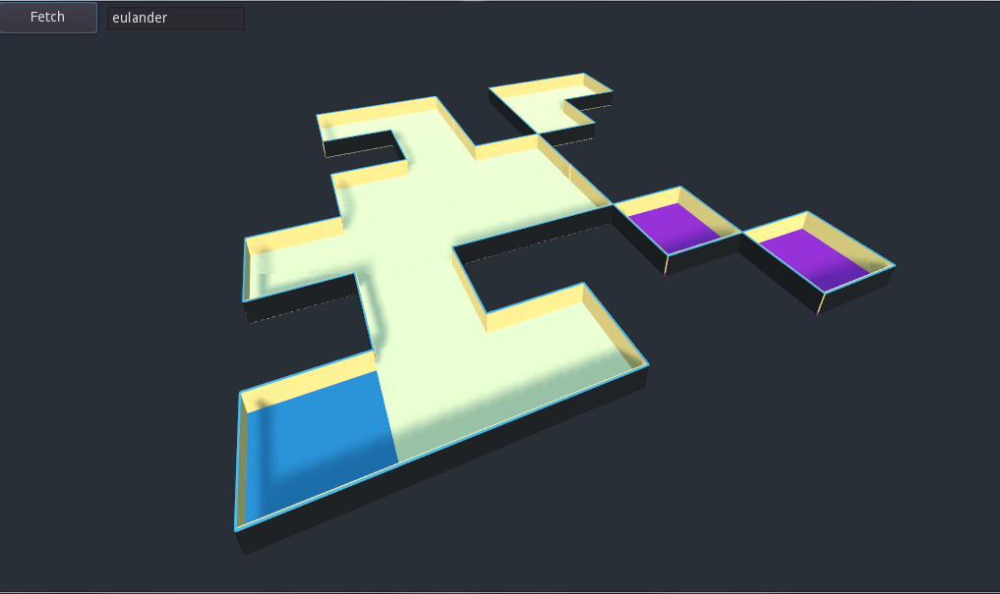

# godot Simple Floorplan Generator

A 3D grid-like base for a floorplan or _room_ using Godot. Demoing JSON fetch, grid mapping and "walls" generation.
Take a look at `spin.gif` for an example of what to expect in motion.


## What is it

Whilst practicing with Godot I wanted to create a _room_ using a simple UI
and serve a JSON to Godot through HTTPS.

This example presents:

+ Generate a random set of _floor_ tiles
+ Wrap all external edges of the floor tiles with walls.

So two tiles sitting side-by-side produces a single walled "room". Continue this
with a grid of 3x3 and you have something like this:



I'm lazy so I don't wish to create "walls" for all rooms therefore the bundled
user interface (a very simple flask site) allows the user to draw a floorplan and
save to JSON.

In the top left of the `gen.tsn` Godot main scene the "fetch" button will call
to `http://127.0.0.1:8000/floorplan` for a JSON representation of a room.


## Web UI

The ugly cheap web ui simply serves to host the clicky flooplan editor, and a
base to fetch plans within Godot. Within the `tools/` folder the `floorplan/`
app, boot the Flask `server.py`.

!!! Note
   Yes I know all of this is ugly and broken as hell so please don't judge me.
   I spent all of some minutes building.


Requirements:

+ Python 3
+ Flask

```bash
pip install flask
```

Then the server:

```bash
> py server.py
 * Serving Flask app "server" (lazy loading)
 * Environment: production
   WARNING: This is a development server. Do not use it in a production deployment.
   Use a production WSGI server instead.
 * Debug mode: on
 * Restarting with stat
 * Debugger is active!
 * Debugger PIN: 113-296-436
 * Running on http://127.0.0.1:8000/ (Press CTRL+C to quit)
```

And you'll see something like this:



You'll see in this example I created a 6x6 grid called "eulander".

It produces JSON similar to this:

```json
{
    "name": "eulander",
    "count": 6,
    "items": [
        1,
        1,
        1,
        1,
        /* ... */
    ]
}
```

You can apply this to the scene by using "fetch" with your new name.



The scene will randomly scramble the grid upon mouse input. If you click (or
scroll the wheel :P) a new scene will generate with the given size. In this
exampe a 6x6 grid:


